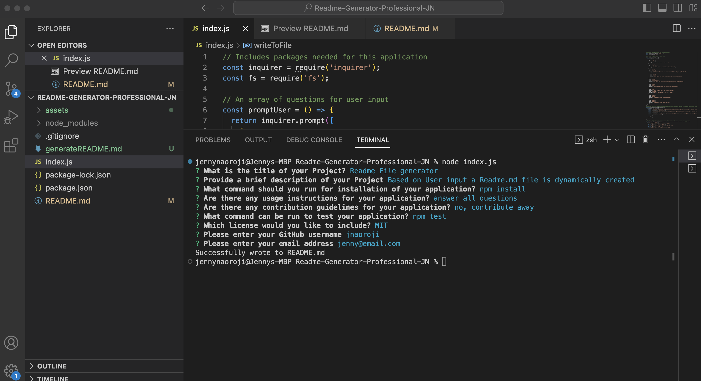
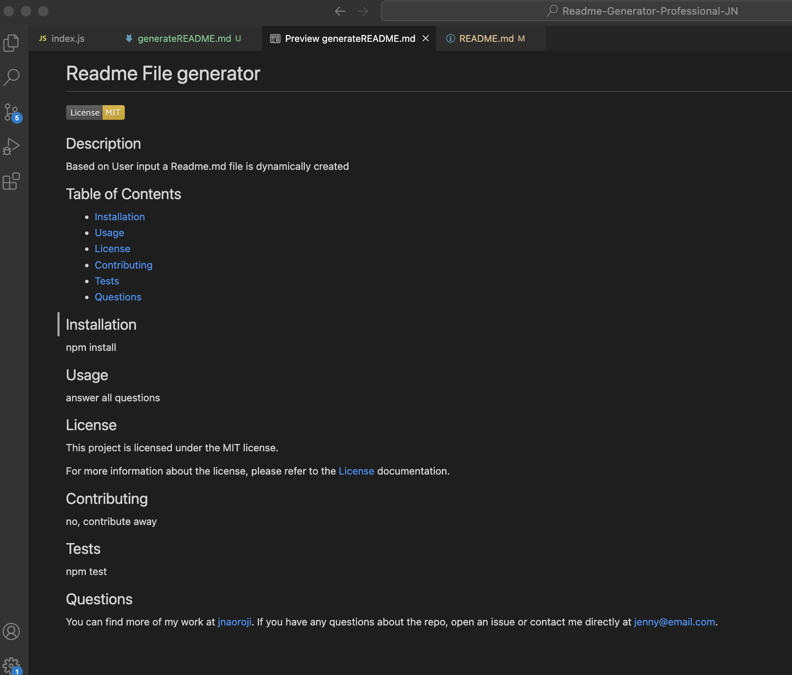

# 09 Node.js Challenge: Jenny Naoroji's Professional README Generator

## Description

My task is to create a command-line application that dynamically generates a professional README.md file from a user's input using the [Inquirer package](https://www.npmjs.com/package/inquirer/v/8.2.4). This allows the project creator to devote more time to working on their project.

## Usage

The application will be invoked by using the following command in the command line:

```bash
node index.js
```

## Screenshot

The following screenshot shows my web application's appearance and functionality:




The following screenshot shows an example of a dynamically generated Readme.md based on user input:




Here is a link to the walkthrough video that demonstrates the functionality of the README generator:
https://drive.google.com/file/d/1CRSt6ZCEtf7GvZLW4MRZSKXuxCW3mfQA/view?usp=sharing


## Credits

* [Inquirer package](https://www.npmjs.com/package/inquirer/v/8.2.4).
* [Professional README Guide](https://coding-boot-camp.github.io/full-stack/github/professional-readme-guide)
* [Fullstack Blog Video Submission Guide](https://coding-boot-camp.github.io/full-stack/computer-literacy/video-submission-guide)


